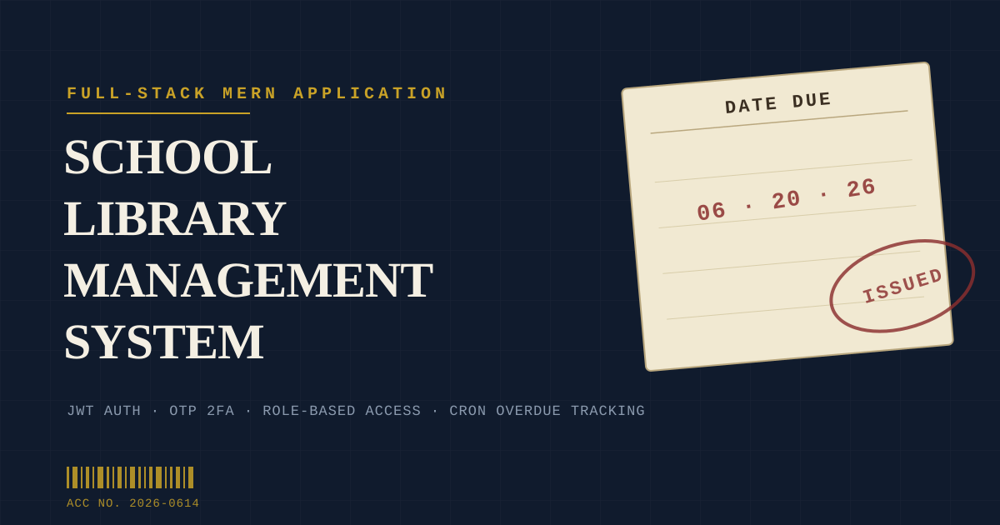

# School Library Management System

# School Library Management System

<p align="center">
  
</p>

<p align="center">
  <a href="https://sch-library-management-system-front.vercel.app">
    
  </a>
  &nbsp;&nbsp;
  <a href="public/og-image.png">
    
  </a>
</p>

<p align="center">
  
  
  
  
</p>

Simple React frontend for a library management system (Vite + React).

Project structure

```
libraryms/
├── public/
├── src/
│   ├── api/
│   │   └── axios.js          ← sets up API connection to your backend (localhost:5001)
│   │
│   ├── context/
│   │   └── AuthContext.jsx   ← stores logged-in user, login/logout functions globally
│   │
│   ├── components/
│   │   ├── Sidebar.jsx       ← left navigation menu (Dashboard, Books, Students etc.)
│   │   ├── Sidebar.css
│   │   ├── Topbar.jsx        ← top bar showing page title and logged-in user
│   │   └── Topbar.css
│   │
│   ├── pages/
│   │   ├── Login.jsx         ← login form (email + password)
│   │   ├── Login.css
│   │   ├── Dashboard.jsx     ← overview stats (books, students, borrows)
│   │   ├── Dashboard.css
│   │   ├── Books.jsx         ← list, add, edit, delete books
│   │   ├── Authors.jsx       ← list, add, edit, delete authors
│   │   ├── Students.jsx      ← list, register, edit, delete students
│   │   ├── Borrows.jsx       ← issue books, return books, view history
│   │   └── Attendants.jsx    ← admin only — manage library staff
│   │
│   ├── styles/
│   │   └── global.css        ← colors, fonts, buttons, tables used everywhere
│   │
│   ├── App.jsx               ← sets up all routes (which URL shows which page)
│   └── main.jsx              ← entry point — starts the React app
│
├── index.html
└── package.json
```

Requirements

- Node.js 18+ (recommended)
- npm or yarn

Quick start

Install dependencies:

```bash
npm install
```

Run dev server (Vite):

```bash
npm run dev
```

Build for production:

```bash
npm run build
```

Preview production build locally:

```bash
npm run preview
```

Notes

- The frontend expects an API backend at `http://localhost:5001` by default — see `src/api/axios.js`.
- Entry points: `src/main.jsx` and `src/App.jsx`.
- Linting: `npm run lint`.

If you want, I can add a sample `.env` or a `README` section explaining API endpoints and authentication flow.
